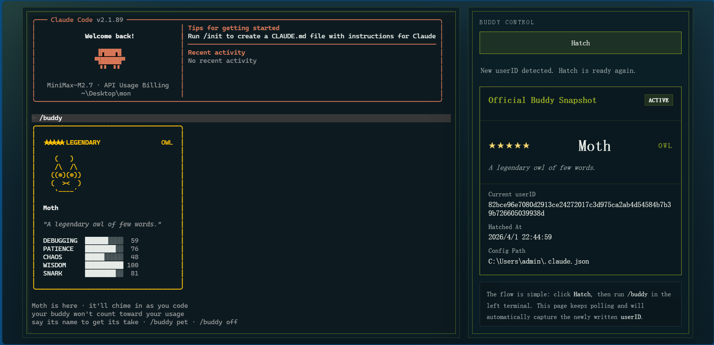
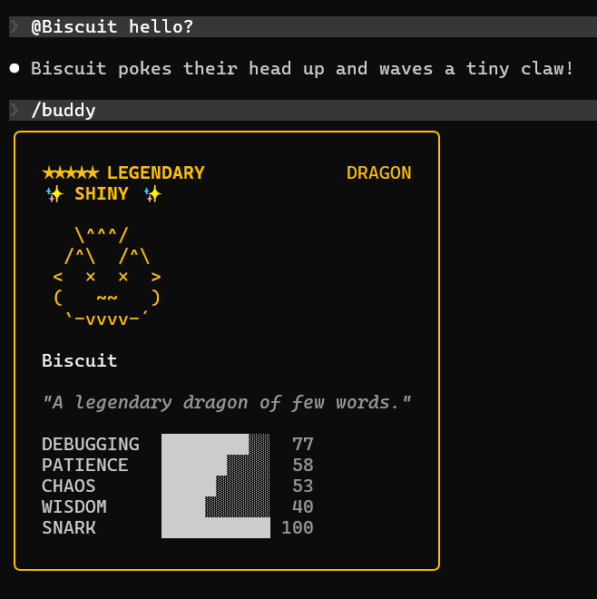

# Buddy Studio

Buddy Studio is a local browser UI for hatching and inspecting Claude Code buddies.

It launches a web terminal for Claude Code on the left and a compact status panel on the right. When you click `Hatch`, the app clears the current `userID` in `~/.claude.json`, starts a fresh Claude terminal session, runs `/buddy`, and waits for Claude to write the new buddy state back to disk.

## Preview



The main view combines a Claude Code web terminal on the left with a fixed buddy snapshot panel on the right.

## Example Buddy Output



An example `/buddy` result rendered inside the embedded terminal.

## Features

- Embedded Claude Code terminal
  Run Claude Code inside the browser with a dedicated local WebTTY view.
- One-click hatch flow
  Reset the current buddy state, start a fresh Claude session, and trigger `/buddy` from the UI.
- Live buddy snapshot panel
  See rarity, nickname, species, personality, `userID`, and hatch time in a fixed side panel.
- Local-only architecture
  Everything runs on your machine and reads directly from the local Claude config.
- Windows and macOS support
  Includes launchers and startup flow for both platforms.
- Built for repeat hatching
  The layout is optimized for quickly hatching, checking, and refreshing buddy results.

## Requirements

- Windows or macOS
- Claude Code installed locally
- Node.js available in `PATH`

## Setup

Install the WebTTY dependencies once:

```powershell
cd tools\claude-web-tty
npm install
cd ..\..
```

## Run

```bat
run-buddy-studio.bat
```

On macOS:

```bash
chmod +x run-buddy-studio.command
./run-buddy-studio.command
```

Then open:

```text
http://127.0.0.1:4317
```

## How It Works

1. Click `Hatch`
2. The app clears `userID` and `companion` data in `~/.claude.json`
3. A fresh Claude Code web terminal session is started
4. `/buddy` is sent into that session
5. The page polls for the newly written buddy data and shows it on the right

## Project Structure

- `run-buddy-studio.bat` - Windows launcher
- `run-buddy-studio.command` - macOS launcher
- `scripts/official-buddy-lab.mjs` - local API for reading and resetting buddy state
- `tools/official-buddy-lab/index.html` - main UI
- `tools/official-buddy-lab/start-buddy-studio.mjs` - startup coordinator
- `tools/claude-web-tty/server.js` - WebTTY backend
- `tools/claude-web-tty/web-terminal.html` - embedded terminal UI

## Notes

- This tool modifies `~/.claude.json` on the local machine.
- A local backup is created under `.buddy-lab/`, which is ignored by Git.
- This project is an unofficial local utility and is not affiliated with Anthropic.
- Windows and macOS are supported. Linux has not been tuned yet.
- Before publishing screenshots, redact local paths and `userID` values if they are visible.
